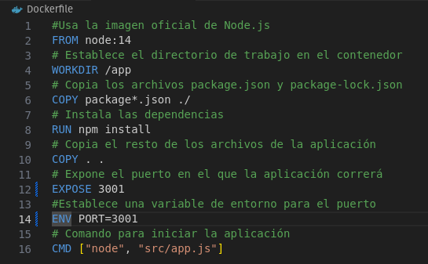

# Preguntas de reflexión:

### - Pregunta 1: ¿Qué significa "desplazar a la izquierda" en el contexto de DevSecOps y por qué es importante? ###

Se refiere a , en vez de esperar al final del desarollo de software, integrarlo desde el principio.  Seguridad proactiva en lugar de reactiva.

### - Pregunta 2: Explica cómo IaC mejora la consistencia y escalabilidad en la gestión de infraestructuras. ###
El estado de la infraestructura se define en el código, mejorando la consistencia, que luego se aplica automáticamente mediante herramientas de gestión de configuración, mejorando la escalabilidad.

### - Pregunta 3: ¿Cuál es la diferencia entre monitoreo y observabilidad? ¿Por qué es crucial la observabilidad en sistemas complejos? ###
El monitoreo involucra estableceer métricas y puntos de referencia predeterminados que, cuando se superar, generan alertas. Su alcance se limita a detectar dónde ha surgido el problema. Por otro lado la observabilidad presenta un enfoque más matizado, no solo incorpora el monitoreo, sino también una visión comprensiva de la salud general del sistema. En sistems complejos, la observabilidad es crucial para entender no solo el dónde falla sino también el por qué.

### - Pregunta 4: ¿Cómo puede la experiencia del desarrollador impactar el éxito de DevOps en una organización? ###
La experiencia del desarrollador es primordial para el éxito de la organización. Si los desarrolladores poseen las herramientas adecuadas, un flujo de trabajo eficiente y sienten que su trabajo es reconocido, se encontrarán "felices". En consecuencia mejorará su colaboración y comunicación(eliminación de silos), incrementando las chances de éxito en la organización.

### - Pregunta 5: Describe cómo InnerSource puede ayudar a reducir silos dentro de una organización. ###
InnerSource permite a los desarrolladores dentro de una organización para contribuir a los proyectos de otros equipos a los que no pertenecen formalmente. Esto a su vez fomenta la comunicación abierta, el intercambio de código y la resolución de problemas en conjunto, reduciendo los silos que a menudo se encuentran dentro de una organización.

### - Pregunta 6: ¿Qué rol juega la ingeniería de plataformas en mejorar la eficiencia y la experiencia del desarrollador? ###
La ingeniería de plataformas proporciona herramientas reutilizables y automatización de operaciones, acelerando el proceso de desarrollo y despliegue.

## Documentación del proceso de la actividad
##
Herramientas de monitoreo(Prometheus) y observabilidad(Graphana)

Le asignaremos a la app el puerto 3001

A graphana el 3000

Y a Prometheus 9090

Modificando el DockerFile

Creando un archivo prometheus.yml

Modificando el archivo docker-compose.yml

Ejecutando  docker-compose up --build

Accediendo a las rutas establecidas

